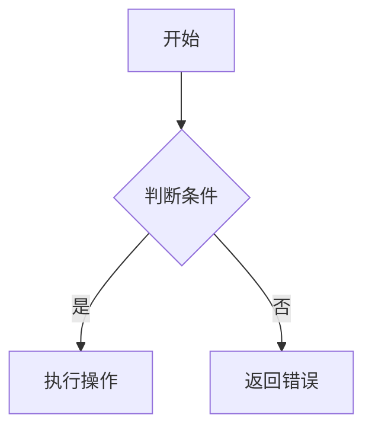

# {Feature Name} 技术设计文档

## 1. 系统概要 (System Summary)
> 简述实现该功能的核心技术路线。说明该功能将如何集成到现有项目中，涉及哪些模块的改动。

## 2. 决策记录 (Decision Rationale)
- **原方案选择**: 简述对比过的方案及最终选择本方案的原因（如：性能、复用性、降低耦合等）。
- **权衡 (Trade-offs)**: 说明为了实现当前设计所做的折中（如：牺牲了一定的灵活性以换取更快的开发速度）。

## 3. 详细设计 (Detailed Design)
### 3.1 逻辑流程 (Logic Flow)
> 使用 Mermaid 语法描述核心业务流程。


### 3.2 目录与模块结构 (Structure)
- `src/components/...`: 新增/修改的 UI 组件。
- `src/hooks/...`: 封装的业务逻辑。
- `src/lib/...`: 工具函数或配置。

### 3.3 数据模型 (Data Models)
```typescript
/**
 * 核心 Interface / Type 定义
 */
export interface {FeatureName}Data {
  id: string;
  createdAt: Date;
  // ...
}
```

### 3.4 交互接口 (APIs / Props)
- **Props 定义**: 列出关键组件的 Props 及其类型。
- **API Endpoints**: 如果涉及后端，注明路径、方法、Input/Output Schema。

## 4. 安全性与异常处理 (Security & Error Handling)
- **防御性编程**: 如何处理非法输入、网络故障、并发冲突？
- **权限校验**: 是否需要登录、角色校验？

## 5. 验证方案 (Verification Plan)
- **自动化测试**: 需要覆盖哪些关键路径（单元测试、集成测试）？
- **手动验证**: 执行哪些步骤可以快速验证功能闭环？
